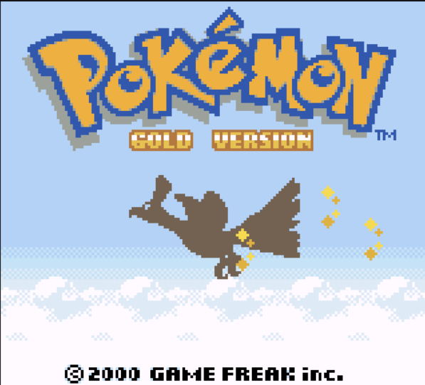

# OhBoy

A Game Boy/Game Boy Color emulator

The emulator core was written in C++ and the GUI was written in Rust using Iced

Looking for the minimal version that can run on a Pi Pico 2? Check the [pico branch](https://github.com/letiendat198/OhBoy/tree/pico)

## Images

|                        |                        |                        |
|------------------------|------------------------|------------------------|
|  |  |  |
|  |  |  | 
|  |  |  | 

## Keyboard Mapping
```
Game Boy:

       |Up|          |Select| |Start| 
|Left||Down||Right|                     |B| |A|

Keyboard:

   |W|          |T| |Y| 
|A||S||D|                     |N| |M|
      
```

## How to build
Require GCC, MinGW or MSVC version that supports C++ 17.
### Prerequisite
- You will need to install [Rust](https://www.rust-lang.org/tools/install) and MinGW
- Download pre-built [SDL2](https://github.com/libsdl-org/SDL/releases/tag/release-2.30.8) (the `devel-mingw` variant for MinGW, `devel-VC` variant for MSVC), 
rename it SDL2 (or SDL2-VC if using MSVC) then put it inside `deps` folder.  Install `libsdl2-dev` if you're on Linux
- Download [imgui_memory_editor.h](https://raw.githubusercontent.com/ocornut/imgui_club/refs/heads/main/imgui_memory_editor/imgui_memory_editor.h) 
and put it inside `deps/imgui` after the git clone step (TODO: Make this a submodule)
### Building
```
# Clone this repository and its dependencies
git clone --recurse-submodules https://github.com/letiendat198/OhBoy.git

# Run CMake
mkdir build
cd build
cmake .. 
cmake --build .
```

#### Note: If you're on Windows, copy `SDL2.dll` and place it in the same folder as `OhBoy.exe`

## Known Issues

- Not passing many tests. Some hard to emulate games will fail. Although crazy accuracy is not
the goal of this project, please open an issue if you encounter a bug, and I'll look into it.

## License

OhBoy is licensed under the MIT license. Its dependencies, however, may not share the same license. Please look at the individual
dependencies and check their licenses yourself.