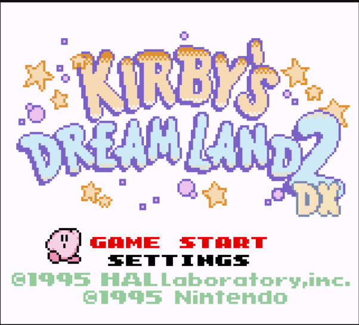
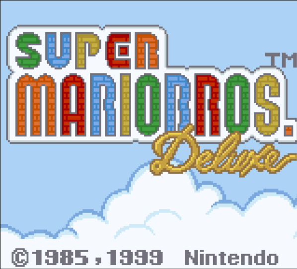

# OhBoy

A Game Boy/Game Boy Color emulator

The emulator core and debugger was written in C++ and the ROM selector GUI was written in Rust with Iced

The core is compiled to a static library with `spdlog` as the only dependency (TODO: Copy spdlog macro to skip it
if logging is turned off). You can link and use it anywhere that can compile C++ code (tested on Pi Pico 2 and ESP32-S3. DMG and CGB ~50-60fps without sound)

`Pico` branch is obsolete. Please include the `CMakeLists.txt` file in `core/` if you only need the core 

## Images

|                        |                        |                        |
|------------------------|------------------------|------------------------|
|  |  |  |
|  |  |  | 
|  |  |  | 

## Keyboard Mapping
```
Game Boy:

       |Up|          |Select| |Start| 
|Left||Down||Right|                     |B| |A|

Keyboard:

   |W|          |T| |Y| 
|A||S||D|                     |N| |M|
      
```

## How to build
Require GCC, MinGW or MSVC versions that support C++ 17.
### Prerequisite
- You will need to install [Rust](https://www.rust-lang.org/tools/install)
- ~~For Windows: Download pre-built [SDL2](https://github.com/libsdl-org/SDL/releases/tag/release-2.30.8) (the `devel-mingw` variant for MinGW, `devel-VC` variant for MSVC), 
rename it SDL2 (or SDL2-VC if using MSVC) then put it inside `deps` folder~~ (included now, zlib license should allow it)
- For Linux: Install `libsdl2-dev`
### Building
```
# Clone this repository and its dependencies
git clone --recurse-submodules https://github.com/letiendat198/OhBoy.git

# Run CMake
mkdir build
cd build
cmake .. 
cmake --build .
```

#### Note: If you're on Windows, copy `SDL2.dll` and place it in the same folder as `OhBoy.exe`

## Known Issues

- Not passing many tests. Some hard to emulate games will fail. Although crazy accuracy is not
the goal of this project, please open an issue if you encounter a bug, and I'll look into it.

## License

OhBoy is licensed under the MIT license. Its dependencies, however, may not share the same license. Please look at the individual
dependencies and check their licenses yourself.