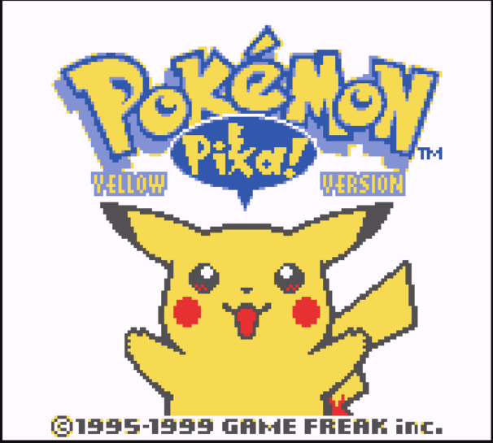
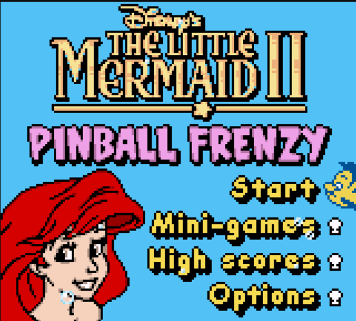

# OhBoy

A Game Boy/Game Boy Color emulator

The emulator core was written in C++ and the GUI was written in Rust using Iced

Looking for the minimal version that can run on a Pi Pico 2? Check the [pico branch](https://github.com/letiendat198/OhBoy/tree/pico)

## Images






## Keyboard Mapping
```
Game Boy:

       |Up|          |Select| |Start| 
|Left||Down||Right|                     |B| |A|

Keyboard:

   |W|          |T| |Y| 
|A||S||D|                     |N| |M|
      
```

## How to build
#### This is a guide for MinGW only! MSVC is probably the same.
- You will need to install [Rust](https://www.rust-lang.org/tools/install) and MinGW
- Download pre-built [SDL2](https://github.com/libsdl-org/SDL/releases/tag/release-2.30.8) (the devel-mingw variant), 
rename it SDL2 then put it inside `deps` folder
```
# Clone this repository and its dependencies
git clone --recurse-submodules https://github.com/letiendat198/OhBoy.git

# My Rust setup uses MSVC by default so I need to target it to build for MinGW
# If your Rust setup is using MinGW already then skip this
rustup target add --toolchain stable-x86_64-pc-windows-msvc x86_64-pc-windows-gnu

# Run CMake
mkdir build
cd build
cmake .. -G 'MinGW Makefiles'
cmake --build .
```

## TODO

- Re-write APU
- Re-do RTC
- Debugger:
  - Add ability to reset CPU state
  - Allow toggling file logging

## Known Issues

- PPU:
  - LY = 153 oddities bug